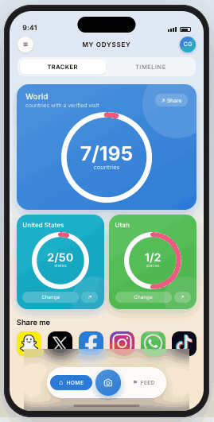
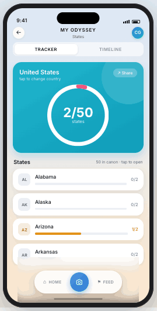
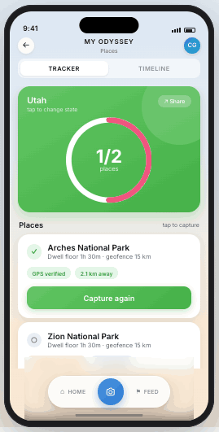
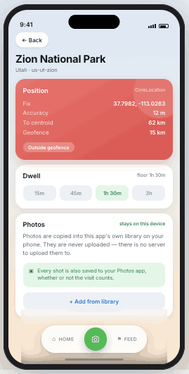
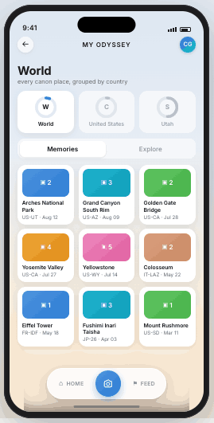
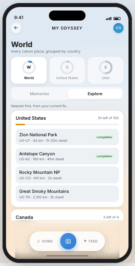
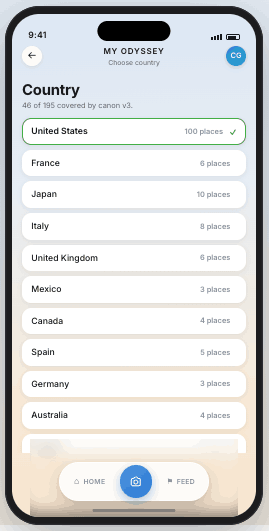
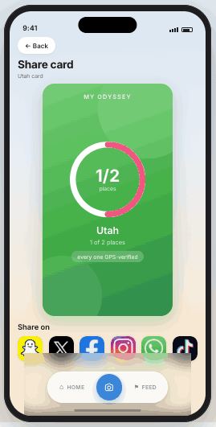
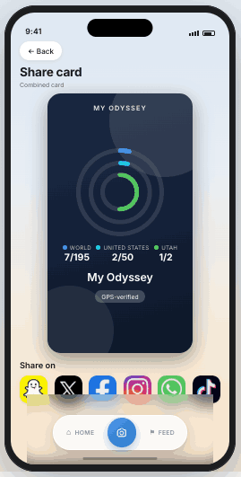
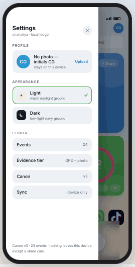

# My Odyssey

A GPS-verified travel completion tracker for iOS. Percentages you cannot inflate:
a place counts only when the phone can prove you stood in it.

Built with Compose Multiplatform. No server — the whole ledger lives on the device,
and a share card is the only thing that ever leaves it.

---

## The idea

Most travel apps let you tick a box. This one does not. Every visit is an event in
an append-only ledger, and the dials are recomputed from that ledger against a
versioned canon of places each time a screen draws — nothing is stored as a total.

Three denominators, one hierarchy:

| Scope | Counts | Shown as |
| --- | --- | --- |
| World | countries with at least one verified visit | blue |
| Country | states complete | cyan |
| State | must-go places visited | green |

Colour carries scope, not decoration. A pink arc is progress in every one of them.

---

## Home

Three dials, one frame, no scrolling. The numbers are the product, so reaching the
third one should not require a gesture.

The country and state tiles are titled with their names — *United States*, *Utah* —
rather than the words "Country" and "State", so the screen tells you what you are
looking at without a legend.

---

## Trackers

Tapping a dial drills down one level. The tile header keeps the dial visible while
the list below carries the detail.

Places outside the canon are in no denominator, so visiting more things cannot
dilute a percentage — and cannot pad one either.

---

## Capture

The camera sits in the middle of the nav, raised. It is the one control you press
while standing somewhere, so it does not wait behind two taps of navigation.

The screen states the evidence before you commit: the fix, its accuracy, distance
to the place's centroid, the geofence radius. Outside it, the tile turns red and the
button reads *Record uncredited visit* — the visit is kept, and it counts for
nothing. Photos are written to the system photo library either way, so an
uncredited day is never lost with its score.

---

## Timeline

Scope is inherited from wherever you arrived, so opening Timeline from Utah's
tracker lands on Utah rather than resetting to the world.

**Memories** shows verified visits only — mixing counted and uncounted made the
grid unreadable as progress. **Explore** is the inverse: what is left, nearest
first, with a badge on anything that would complete a state.

---

## Pickers

Every state shows its own progress, so choosing where to look is also a summary.
Countries outside the canon are listed but disabled, with the reason stated rather
than hidden.

---

## Share cards

The card is the entire privacy surface — aggregate by construction, with no place
names, dates or coordinates.

The combined card nests all three scopes as concentric rings on a dark ground,
each in its scope's colour so the legend confirms the chart instead of decoding it.

---

## Settings

Light and dark are real themes rather than a filter: surfaces flip, and the status
colours re-tint for the ground they sit on. The scope hues stay fixed in both, so
"blue means world" survives the switch.

---

## Notes on a few decisions

**Rings tell the truth.** World reads 7/195 — 3.6% — so its arc is genuinely short.
An earlier version drew the track thinner than the progress stroke, which made short
arcs look like stray lozenges floating on the tile. Track and arc are now the same
width, so a small number reads as a small filled part of a whole ring.

**Evidence tiers never downgrade.** A GPS-verified visit cannot later become a
claim. Claims can only be upgraded, never the reverse.

**Nothing is a total.** Every number on every screen is derived. Deleting an event
changes the past correctly, because there is no cached score to disagree with it.

---

Design and build: Chanukya Gattu. Screens are the live prototype, not mockups.
